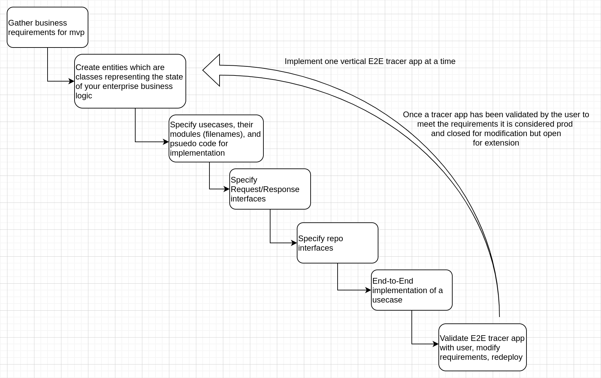
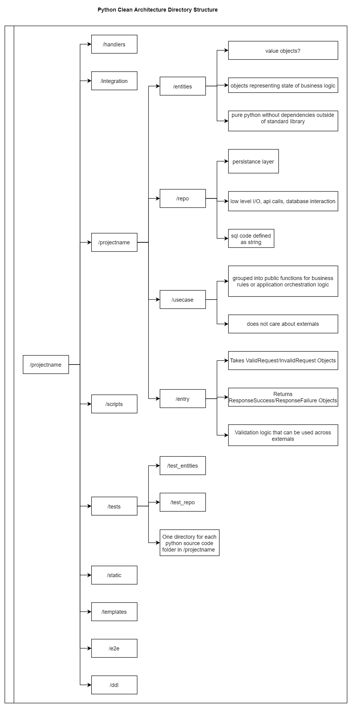

Collection of architecture notes I have from books, news feeds, online tech talks.

The goal is to slim down the source material into the smallest amount of actionable information

# table_of_contents
- [table_of_contents](#table_of_contents)
- [aws_news](#aws_news)
  - [builders_library](#builders_library)
  - [whats_new](#whats_new)
  - [summary](#summary)
  - [recommendation](#recommendation)
- [architecture_patterns_with_python](#architecture_patterns_with_python)
  - [summary](#summary-1)
  - [recommendation](#recommendation-1)
- [clean_architecture](#clean_architecture)
  - [summary](#summary-2)
  - [recommendation](#recommendation-2)
    - [design_takeaways](#design_takeaways)
      - [software_design_phases](#software_design_phases)
      - [python_directory_structure](#python_directory_structure)
- [clean_architectures_in_python](#clean_architectures_in_python)
  - [summary](#summary-3)
  - [recommendation](#recommendation-3)
- [datastores](#datastores)
- [eloquent_javascript](#eloquent_javascript)
  - [summary](#summary-4)
  - [recommendation](#recommendation-4)
- [http](#http)
- [javascript](#javascript)
- [npm](#npm)
- [podcasts](#podcasts)
  - [summary](#summary-5)
  - [recommendation](#recommendation-5)
- [refactoring](#refactoring)
  - [summary](#summary-6)
  - [recommendation](#recommendation-6)
- [test_driven_design](#test_driven_design)
- [the_mythical_man_month](#the_mythical_man_month)
  - [summary](#summary-7)
  - [recommendation](#recommendation-7)
- [webpack](#webpack)

# aws_news

## builders_library
Notes on white papers [published by AWS architects](https://aws.amazon.com/builders-library/) describing best practices learned when building aws.

## whats_new
Folder that contains notes from the [whats new on aws news feed](https://aws.amazon.com/new/) for service announcements/upgrades.

## summary
aws has an rss style feed that describes
https://aws.amazon.com/new/

## recommendation
Yes, but do not read every post, skip the "AWS is expanding this service to region X in order to increase our number of service announcements on next year's reinvent presentation".

I personally skip stuff that is not applicable to me (Game tech, IoT, etc.)

The biggest benefit is I can find a new service or feature I was unaware of previously.

# architecture_patterns_with_python
authors:
- Harry Percival
- Bob Gregory

## summary 
Mostly focuses on domain driven design, event based architecture.

## recommendation
Skip, examples are way too specific to the retail use case. Some general material, but not enough to justify the time investment

# clean_architecture
authors:
- Robert Martin

## summary 
Clean architecture, SOLID design principles, how to minimize the number of resource to build/maintain software systems

## recommendation
Yes, highly recommend

### design_takeaways

#### software_design_phases

#### python_directory_structure

# clean_architectures_in_python
authors:
- Leonardo Giordani

## summary 
Overview of the Clean Architecture with test driven examples with python

## recommendation
Yes, the second edition. The first edition tries to do too much with the test driven development.
One criticism I do have with this book is far too many external dependencies in my opinion.

# datastores
Notes on fancy distributed data storage systems I will probably never use

# eloquent_javascript
author:
- Marijn Haverbeke

## summary
Overview of programming and javascript language

## recommendation
Yes, skip chapters on topics you are familiar with and any of the game design chapters. Skip any sections that focus on building an interpreter for javascript

# http
http protocols notes

# javascript
- node, javascript specific notes

# npm
general npm notes

# podcasts

## summary
My best attempt to curate software engineering advice that I have internalized from listening to various tech podcasts over the years

## recommendation
Yes

# refactoring
author:
- Martin Fowler
- Kent Beck

## summary
Applying refactoring as a proactive part of the development process

## recommendation
Yes, an interesting take on how to continually improve your code base. Not every refactoring pattern will hit home, but some certainly will

# test_driven_design
- theories on the best approaches for building up an automated test suite you can believe in

# the_mythical_man_month
author:
- Frederick Brooks

## summary
- Collections of essays on how to estimate timeline and structure teams for enterprise software development projects

## recommendation

# webpack
General webpack notes from the docs