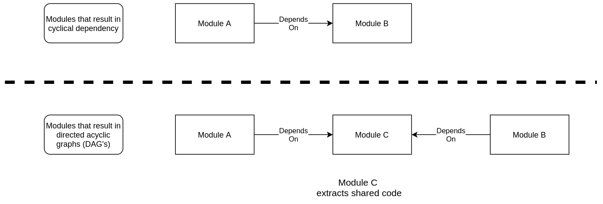

- [author](#author)
- [software_guidelines_ch1](#software_guidelines_ch1)
- [functionality_versus_maintainability_ch2](#functionality_versus_maintainability_ch2)
- [programming_paradigms_ch3_ch6](#programming_paradigms_ch3_ch6)
- [solid_ch7_ch11](#solid_ch7_ch11)
- [open_closed_principle_ch8](#open_closed_principle_ch8)
- [liskov_substitution_principle_ch9](#liskov_substitution_principle_ch9)
- [interface_segregation_principle_ch10](#interface_segregation_principle_ch10)
- [dependency_inversion_principle_ch11](#dependency_inversion_principle_ch11)
- [component_grouping](#component_grouping)
- [module_coupling_ch14](#module_coupling_ch14)
- [software_architecture_ch15](#software_architecture_ch15)
# author
Robert C Martin

# software_guidelines_ch1
> architecture is a hypothesis that needs to be proven by the implementation

- software engineering requires a passion for the craft and a desire to be professional
- The goal of software architecture is to minimize the human resources required to build and maintain the desired system

# functionality_versus_maintainability_ch2
- The time it takes to make a change to a software system should be proportional to the size of the feature request, not where the feature request fits in the existing system

- It is easier to maintain a program that is easy to change, but does not meet the current business requirements than maintaining a program that meets the current business requirements but is impossible to change

# programming_paradigms_ch3_ch6

- structured programming taught us that unrestricted direct transfer of control like GOTO statements make it impossible to break down code into small, modular pieces

- We should never use break statements and strongly bias towards if/for loops transfering control to a function call?

- testing shows that a software product is correct enough for our purposes, not that a program is bug free

- Encapsulation and polymorphism are programming techniques that can be implemented just as easily in a functional style as an object oriented class-based style?

- Device independence = strive to make our programs able to complete the same jobs on different devices

- **Dependency Inversion (p.44-46)** = Business Rules(entities/usecase) call the interfaces of of lower level modules (repo/UI/externals)
  - The lower level modules can be developed and deployed independently as long as they implement the design by contract outlined in the interface

- Main entry point calls you usecase as part of the flow of control, but does not depend on anything other than the interface(name of the function) for intializing the program


- There should be a clear separation between immutable and mutable components, where mutable components are encapsulated behind an abstraction/interface and we strongly preference immutable components?


- event sourcing = store all transactions and when state is required, we apply all the transactions from the beginning of time


# solid_ch7_ch11
- The clean architecture is applied at the directory level (repo/entities/usecase), while SOLID is applicable to modules(file name) and components(public interface functions/private implementation functions)?

- Design by contract is validated with test cases for public components?
- For private functions, we are testing to make sure our implementation applies the necessary logic to implement the interface? 
  - These test are independent of interface test cases for complicated applications?
  - Try to test as many components as possible in one test case if there is no external I/O in any of the individual components?

- Don't patch what you don't own, use fakes instead?

- Single responsibility principle guidelines:
  
  - In python, only public functions are allowed to be imported outside a module(file name), while anything that starts with an underscore ```_``` should not be used outside the module?
  
  - In JS, only exported functions/data can be called outside a module(file name)?
    - Should we test complicated implementation, because jest cannot patch non-exported private functions like you can test private functions in python?
    - DHH point that you should only mock external network calls 

# open_closed_principle_ch8
- components should not have circular dependencies, all dependencies should flow in one direction between modules
- if component A needs to be protected from changes in component B, component B should import component A and component A should have no knowledge of component B

- Higher level components should be protected from lower level components by having the lower level components implement interfaces since they are closer to the input/output
  - higher level components use/import these public interfaces, allowing the implementations to be easily modified without affecting higher level structures

# liskov_substitution_principle_ch9
- REST API's should have well defined input/output via an OpenAPI and **consistently** follow these design by contract behaviors reguardless of the implementation

- Having a public functions interface that can easily swap private implementations without affecting the public functions contract is most critical for functions are invoked by other layers


# interface_segregation_principle_ch10
- It is harmful to depend on modules that export more public functions than what you use
  - Where do you set the tradeoff between module initialization overhead versus the decoupling having many modules provides?

- We should preference many small public functions over large functions with lots of parameters that can be reused in different contexts?


# dependency_inversion_principle_ch11
- dependency inversion principle = preference having source code dependencies on interfaces/abstractions, not on concrete implementations

- Statically typed languages enforces the interfaces/abstractions at compile time, where dynamic languages like python are not as strictly enforced, so it is up to the software engineer to design and implement clearly defined interfaces/abstractions

- changes to an interface/abstraction always result in a change in implementation, while an implmentation change can still meet the interface

> Don't derive from volatile concrete classes


- The abstraction/interface components (public functions) contain all the business rules, while the concrete implementation provides the details of how to meet the abstraction/interface


# component_grouping
- For most applications, maintainability is more important than reusability
- Shared libraries must be versioned with an upgrade plan


# module_coupling_ch14
- All module dependencies should be directed acyclic graphs (DAGs) = one way dependencies where it is impossible to follow a modules dependencies back to itself


- Options for breaking cyclical/circular dependencies:


1) Dependency inversion principle = Apply a public interface between two modules you want to reverse the dependency for


2) Extract the shared dependency into a new module that has no dependencies




- stable dependencies principle = depend on modules that are more stable


- When a component has no dependencies, but is imported in many other components:
  - It is more difficult to change, more stable and independent of other module changes

- When a component depends on many other modules, but nothing imports it:
  - it is easy to change, volatile, and dependent of other module changes

- stable abstractions principle = depend of components that will be extended with the open closed principle instead of modified
  - a functional implementation of this is to never modify public functions but to instead create new ones


- all components (modules/functions/classes) should either be:
1) stable = many other modules import it and closed for modifications
2) unstable = no/few modules import it and able to change out the private implementation frequently.


# software_architecture_ch15

- The tradeoff of microservices is the work needed to configure and connect the different services via service discovery

- Since hardware is cheaper than people, performance efficiency should always be a second tier concern behind ease of development, ease of deployment, minimizing maitenance and minimizing architecture complexity

- Once the high level policy (business rules) is defined (Entities/Usecase), the implementation details can be developed/deployed independently

- Abstract device I/O behind a public interface so the private implementation details can be swapped to make the implementation of your business logic device independent

- Decouple your device dependent storage implementation details from the business rules policy implementation