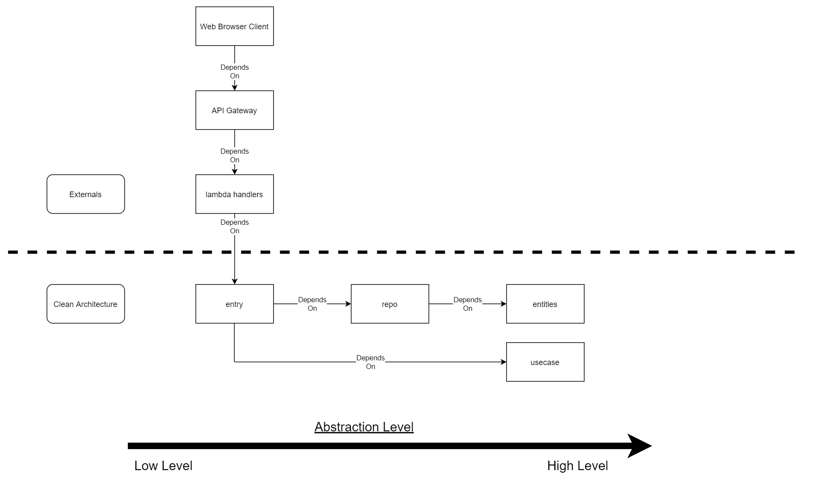

# layer_dependency_structure

- lambda handler imports validators/entry
- lambda handler calls entry with ValidRequest object
- entry imports repo/usecase
- entry only takes ValidRequest objects, returns ResponseSuccess/ResponseFailure objects 
- entry orchestrates I/O from repo, but only invokes usecase by passing entities or python built ins as arguements

# layer_description

- usecase and entities layers should have no I/O, be pure functions, and easy to test

## entities
- entities layer = enterprise business rules representing current state as data classes

## entry
-  requires a ValidRequest object, can invoke repo and usecase layer
-  returns ResponseSuccess or ResponseFailure

### validators
- module within entry that defines ValidRequest/InvalidRequest objects
- Defines ResponseSuccess and ResponseFailure objects

- validators that provide an abstraction/can be reused between externals (lambda, frameworks, libraries, UI) trying to call business logic

## repo
- I/O with persistant storage, apis, 3rd part libraries or frameworks
- returns (return_val1, None) is successful
- returns (None, string_representation_of_error) if there is an error
- Can return multiple values as long as the last value returned is either a string error or None

## usecase
- usecase layer = application specific business rules and orchestration

## validators

