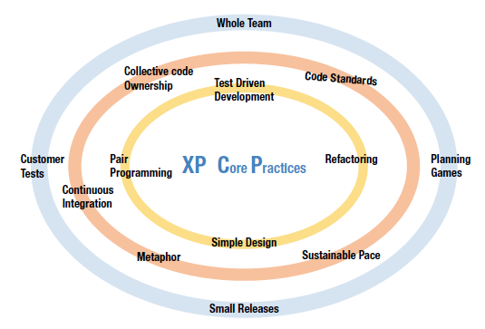

- Reaching a high percentage of unit test coverage to check the box results in flaky tests

- Test driven development creates a test suite you trust with your professional life

- A passing test suite should provide confidence that all the business rules are met and that your code is deployable

- TDD is not coupled to the code, has small cycle times and runs in seconds

**Laws of TDD**
1) write no production code until you have a test case that fails due to the lack of the production code

2) write only enough test code that is sufficient to make the test case fail

3) write no more production code than what is necessary to make the test case pass

- Tests are the safe source documentation for how to invoke/use an interface

- Red -> green -> refactor
- First focus on the functionality then focus on the design structure

- Every engineer on the team leaves the code in a better place than when they checked it out because they know a passing test suite meets the business requirements
