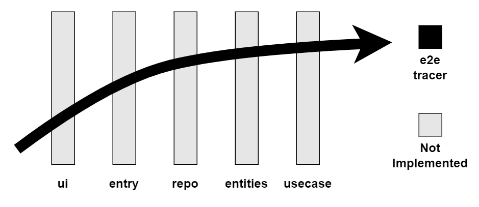

# values
- kaizen = take ownership of constantly improving your work
- when you miss a delivery expectation, provide options not excuses
- fix broken windows of bad code design, implementation and roadblocks as soon as they appear
- make quality and scope part of the requirements
- Make a habit of investing in your technical skills by diversifying and managing risk of knowledge gaps in new technologies/programming environments you are not familiar with
- software engineering values help you make quick decisions by consciously re-enforcing self-discipline
- evaluate each design decision in terms of how easily it can be changed in the future

# communication
> the meaning of your communication is in the response you get

- prepare before communicating, prioritize listening to your audience, consider the correct time to present the material, apply MVP to all communication/meetings
- focus non-api commenting on why something is done because the code shows how it is done, keep DRY in mind
- email is permanent so make sure to reflect before sending and maintain the habit of not complaining no matter the recipient

# dry
- every piece of knowledge must have a single, unambiguous, authoritative representation within a system
- whenever a module exposes a data structure it couples your implementation to that data structure
- be cognizant of duplicating business logic in docstrings and the implementation of private functions

# decoupled_systems
- modules should never expose any unnecessary interfaces, never rely on other modules implementations, and have any context passed in as parameters
- implementation changes should be localized to a specific unit test case 

# reversability
> nothing is more dangerous than an idea if it is the only one you have

> there are no final decisions

- delay and hide critical implementation details (3rd party api's, database schemas) behind your own abstraction layer interfaces

# e2e_tracers
- prioritize critical requirements and the biggest technical risks first with each tracer
- build apps with production intent e2e across architectural layers with the smallest functionality that improves the existing customer baseline

- prototypes are disposable and focus on testing a specific aspect of a system
- use a UI tool that focuses on appearance/interactions without spending time on the code/markup

# tooling
- the best format for persisting data is plain text because it can be understood without the application logic, parsed in any programming language, and outlives the lifespan of the application that created it

- Make a habit of saying 'there has to be a better way' whenever something is repetitive (replace repetition with a shell alias)

# debugging_techniques
- binary search on stack traces/input data
- assume the root cause is always your application code
- explain the problem out loud to check your assumptions
- evaluate the root cause of the bug using your software engineering disciplines instead of panicing

# design_by_contract
- if a functions preconditions are met by the client, that method guaruntees all postconditions and system state invariants will be met upon completion
- design by contract is more efficient than defensive programming where data is validated everytime because a function should not be invoke unless its preconditions are met

- dead programs tell no lies
> to light a candle is to cast a shadow
- the function/object for opening a resource should also close that resource

- ensure there is a process to expire any logging data created by your application
- when allocating multiple resources, deallocate each resource in the opposite order they were allocated
- verify that a resource was allocated before attempting to deallocate that resource in a finally block
- take small development steps based on feedback from users

# estimation_activities_that_are_guesses 
- completion dates for months in the future
- planning a design based on future maitenance
- guessing future user needs
- guessing future technology capabilities

- do not make mutation decisions on an object based on the internal state of that object
    - tell, don't ask when mutating
    - Either query the state of the object or issue a command mutating it
- mutable external resources (databases, file systems, API's) should always be wrapped behind interfaces you control

- draw out a state machine to visualize how your system should handle events
- observer pattern = list of funcitons that get invoked when an event occurs

- publish/subscribe model = publishers push events to a channel, subscribers listen to events in a channel, neither are responsible for the interface of the channel
    - good for asyncronous handling of events, bad for observing a system wholistically