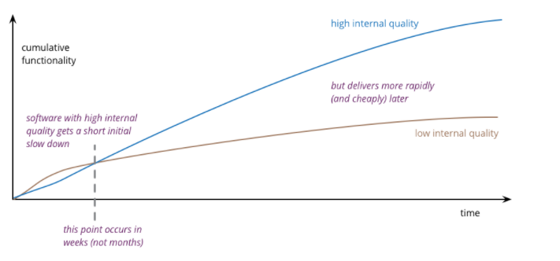

- the inherent value in investing in high internal code quality is the ability to release new features more quickly

[image source](https://martinfowler.com/articles/is-quality-worth-cost.html)

- the initial feature release time might be quicker in a low quality code base

- more frequent prod releases correlate with increased prod system stability 

- focus on selling the economic benefits of high internal code quality instead of professionalism arguments 

- even software engineers who follow TDD, have CI/CD pipelines, write modular code, follow SOLID accumulate technical debt because end user requirements change once they begin using a released product

- the best engineers focus on continually refactoring and continuously improving their development process in order to avoid having unexpected new requirements impact new feature release velocity 