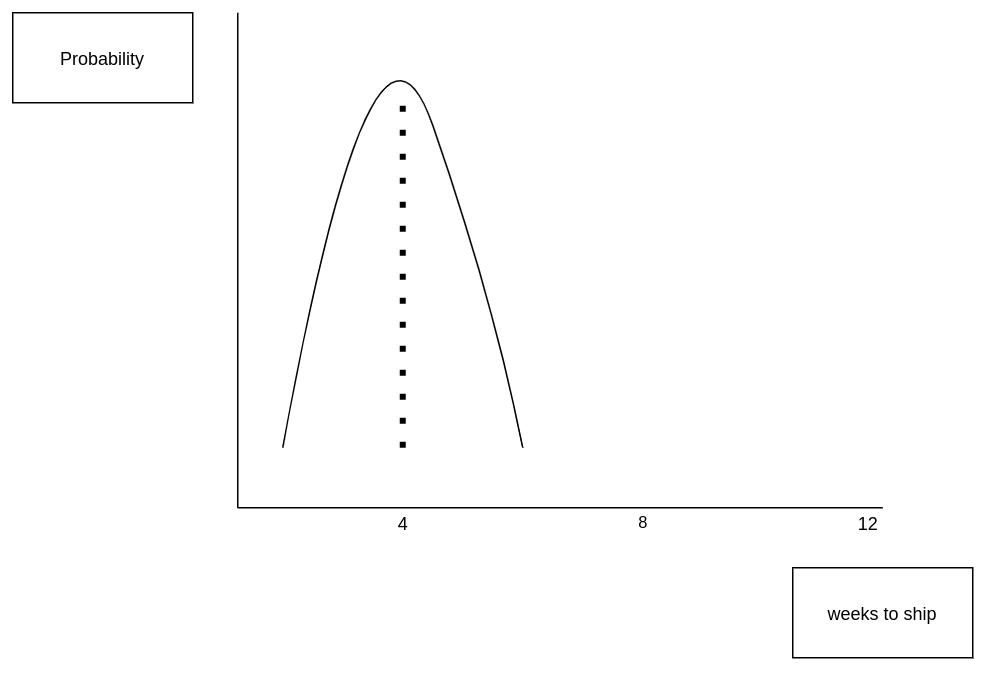
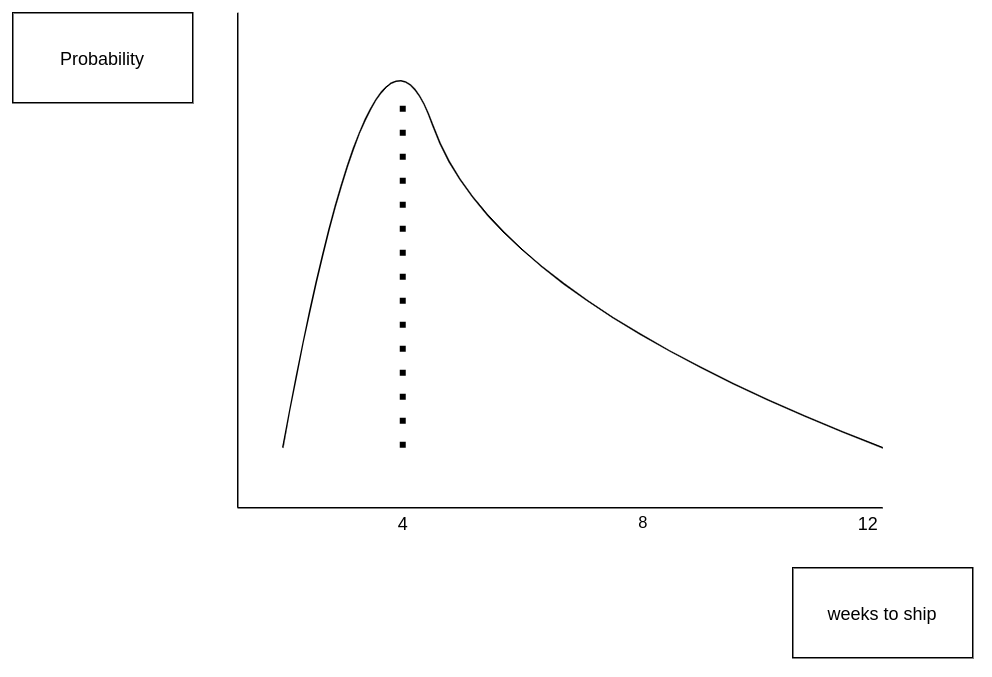
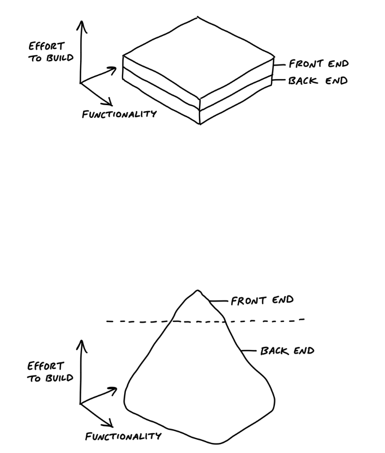
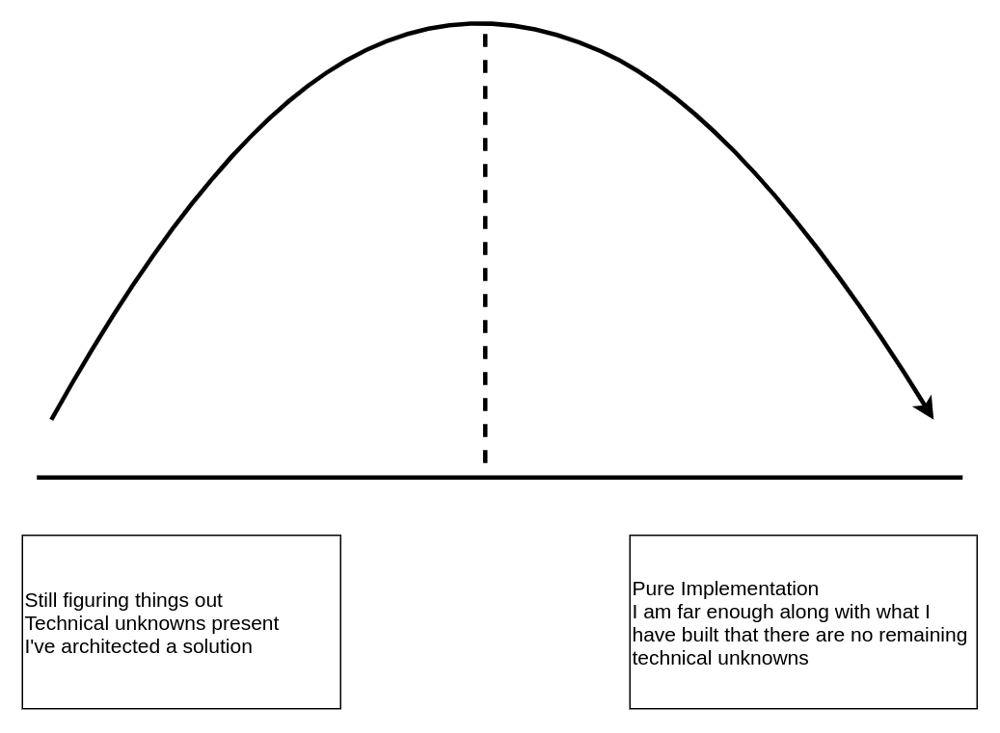

- [shaping_projects_ch2](#shaping_projects_ch2)
- [setting_project_boundaries](#setting_project_boundaries)
- [project_risks_ch5](#project_risks_ch5)
- [pitching_projects_ch6](#pitching_projects_ch6)
- [pitch_backlog_ch7](#pitch_backlog_ch7)
- [choosing_pitches_ch8](#choosing_pitches_ch8)
- [start_of_projects_ch10](#start_of_projects_ch10)
- [vertical_development_ch11](#vertical_development_ch11)
- [breaking_down_a_project_ch12](#breaking_down_a_project_ch12)
- [ch13](#ch13)
- [when_to_stop_ch14](#when_to_stop_ch14)
- [feedback_from_shipping_ch15](#feedback_from_shipping_ch15)
- [key_concepts](#key_concepts)

- fixed time variable scope = do not ask the time it takes to develop a feature, set how much development time the idea is worth 
- circuit breakers = if you do not deliver a feature within an iteration it does not get an extension
- Start each iteration cycle by building one demoable e2e piece starting with the biggest technical unknowns

# shaping_projects_ch2

- fat marker sketch = rough idea that solves the business problem without the fine details worked out
- Address potiential risks and rabbit holes in your project pitch document

# setting_project_boundaries
- The default response for any new issue should be to not immediately put it in a backlog but to gather the context of whether it is really important and what developer resources it might entail

- define how refactors/redesigns affect a specific business problem statement, because otherwise you will never know when a refactor/v2 of a product is truly done

- Each new feature should have a raw idea, business problem statement, risks, and proposed scope that fits within your time appetite

# project_risks_ch5
- you want to bet on projects with independent, well understood parts that assemble together in known ways

- potential risks:
  - new technical work never done before
  - assuming a design solution exists that you havent come up with yourself

- preference pitches whose risk profile distribution is centered around your iteration circuit breaker  

- Over those whose risk profile has a long tail due to a large number of technical unknowns  

# pitching_projects_ch6
- Anybody can suggest expensive and complicated solutions, it takes discipline and reflection to shape a simple idea that fits within a time appetite
- elements of a pitch: business requirements, time appetite, solution, risk, out of scope

# pitch_backlog_ch7
- Do not have a backlog, evaluate what you are doing before each iteration with a pitch
- Important ideas do not get lost, they will come up again in a future pitch meeting

# choosing_pitches_ch8
- iterations need to be long enough to complete a project e2e, but short enough so the pressure of a deadline does not can be used to enforce tradeoffs

- Only pick up a feature/pitch if you agree:
  - it can be completed e2e in 1 iteration
  - the development team will be given uninterrupted development time for the whole iteration
  - a circuit breaker will be invoked if the iterations time limit is hit

- There is nothing special about bugs that makes them automatically more important than everything else if your core business requirements are being met by the application
- All software has bugs, few are critical enough to where you should drop everything to fix a bug instead of prioritizing a fix in a future iteration

- bugs should be prioritized for pickup in an iteration like any feature release
- Never commit to work more than 1 cycle iteration at a time, because the work in the current iteration always informs prioritazation in the next one.
- Do not carry any technical debt over from a previous iteration, otherwise you are not honoring your circuit breakers

- Consider whether a project improves the current customer baseline and if it has long tail risk from a development time perspective

# start_of_projects_ch10
- Each iteration culminates in a deployment (including testing/qa) or a circuit breaker
- many programming tasks are not discovered until you actually start working on your first e2e tracer app

# vertical_development_ch11
- The goal of each iteration is to begin with one working implementation of a frontend to backend e2e feature

- begin a UI design with just enough content to wire it up to the backend to test
  - visual stlying is important for the end product, not in the early stages

- Begin each cycle with the business usecases that present the largest technical risk to shipping on time

# breaking_down_a_project_ch12

- Break apart and report iteration progress using the high level business feature name (corresponds to a usecase/project scope/e2e tracer) 
  - Keep track of technical todos, risks, implmenetations, and unknowns separately 

- scope hammer edge cases into future backlog feature requests instead of expaning project scope that would exceed your time appetite 

- build E2E regaurdless of the distribution of effort between frontend and backend 

[image source](https://basecamp.com/shapeup/3.3-chapter-12#icebergs)

# ch13

- begin an iteration with the most important project scopes with the biggest technical risks before moving onto the tasks your development team has implemented many times in the past

# when_to_stop_ch14
- compare the new feature to the existing customer baseline, not a perfect design that doesn't exist

- Evaluate every programming task as *Nice to haves* versus *must haves in order to ship a product before the iteration circuit breaker arrives

- Code quality and critical business requirements must be owned by the software engineer
  - Any PR's or user feedback should be viewed as optional/nice to haves in the current iteration and prioritized accordingly in future iterations

# feedback_from_shipping_ch15
- feature releases lead to feature requests, sugggestions and bugs that need to be shaped/prioritized in a future iteration
  - Default to a soft no as long as the customer is better off than the previous baseline

# key_concepts
- set time appetites
- shape versus unshaped work
- having a defined deadline prevents scope creep
- outline UI with fat marker sketches
- Make bets with capped downside
- honor bets with uninterrupted development time
- circuit breaker
- cool down between iterations
- break iterations down into vertically deployed usecases
- hill graphs for unknown and known development phases
- scope hammering must-haves from nice-to-haves

- How much developer time is this feature worth?
- Evaluate every taks by how it impacts your EV (expected value) of shipping

- Focus on shipping something impactful each iteration instead of daily firedrills

- [glossary defining terms](https://basecamp.com/shapeup/4.5-appendix-06)
